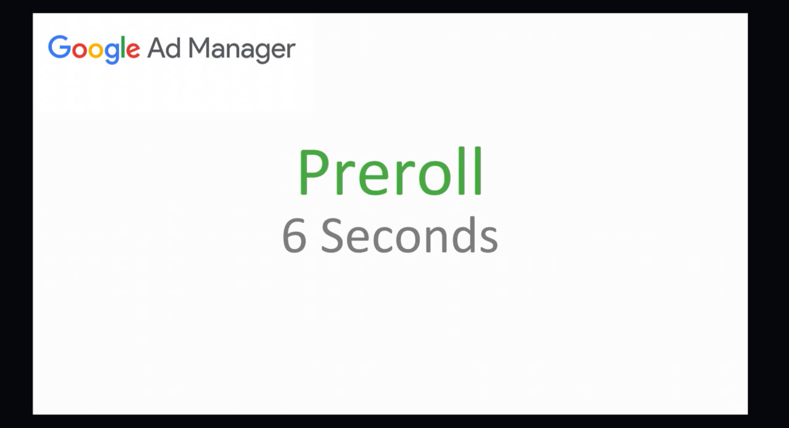
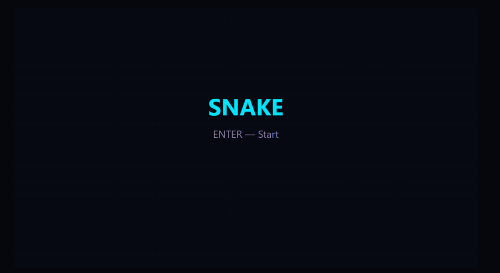
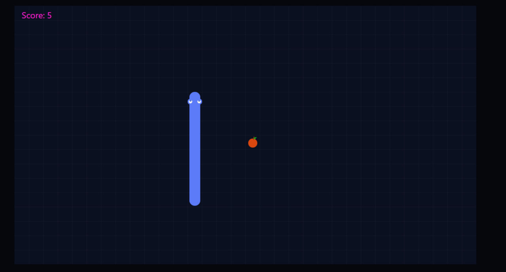
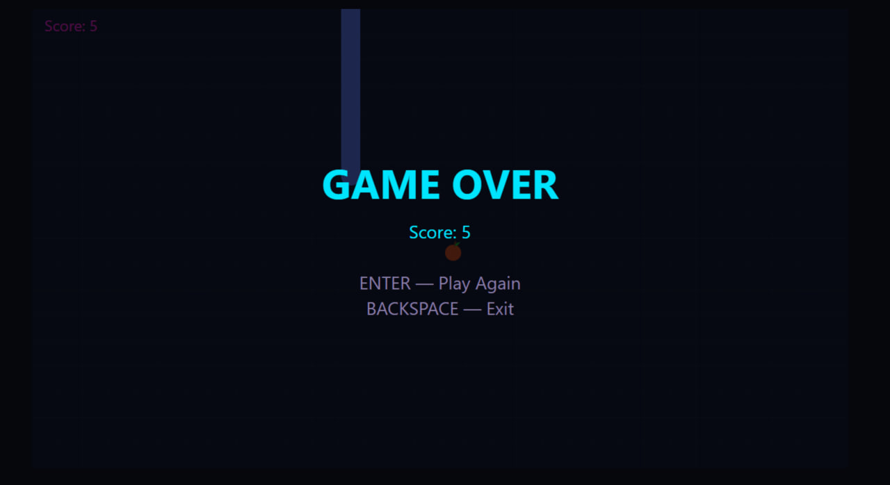

# Coding Assignment

## Required:

- TypeScript or JavaScript
- No game engine
- Single-page application
- Chromium-based browser support
- Fixed resolution: 1280 × 720
- Keyboard controls
- Google IMA SDK integration
- OOP, architecture and design patterns

## Requirements:

1. Create a classic Snake game.
2. The snake is controlled with the arrow keys.
3. The snake grows and the score increases after eating food.
4. The game continues until the snake collides with a wall or with itself.
5. On the start screen, ask the user whether they want to play:
   - `Enter` — show a video ad and start the game.
   - `Backspace` — exit to any external page.
6. After game over, display the final score and ask whether the user wants to play again:
   - `Enter` — show a video ad, reset the game and start again.
   - `Backspace` — exit to any external page.
7. Every time the user presses `Enter`, a video advertisement must be shown before the requested action.
8. Use the Google IMA SDK with Google's test video advertisement. No registration or API key is required.
9. The advertisement resolution is 1280 × 720.
10. Do not use HTML UI elements such as buttons, alerts or progress bars.
11. Rendering can be implemented with DOM, Canvas or WebGL.

## Implementation:

- Canvas 2D renderer
- Custom game loop based on `requestAnimationFrame`
- Menu, playing and game-over states
- Direction queue with opposite-direction protection
- Custom movement, growth, food placement and collision algorithms
- Constructor-based dependency injection
- Separate renderer, input, sound, advertisement and game-loop services
- Google IMA test video advertisements
- Reusable snake tail segment during normal movement
- Cached static field layer

## Controls:

- `Arrow Up` — move up
- `Arrow Down` — move down
- `Arrow Left` — move left
- `Arrow Right` — move right
- `Enter` — show an advertisement, then start or restart the game
- `Backspace` — exit to any external page

## Run Project:

- npm install
- npm run dev

## Production Build:

- npm run build
- npm run preview

## Screenshots:

